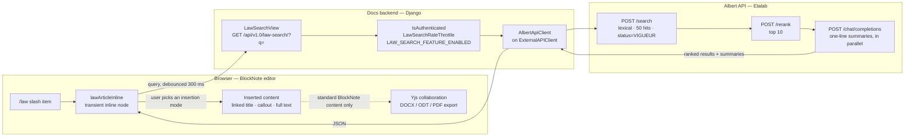

# `/law` - legal references inside Docs

A slash command for [Docs](https://github.com/suitenumerique/docs) that searches French legal texts and inserts them into a document, without leaving the editor.

Built during the DINUM x 42 Hackathon by Les slasheurs
AI was used to generate an important part of the code.
Figma designs are available [here](https://www.figma.com/design/mDkEb8Pl4A4DFeQ7Xez11d/Hackathon-Dinum-x-42-----Link-a-Law?node-id=0-1&t=ctJKVJ6adrDpoWmr-1)

# The need

Quoting the law is a common task for a civil servant, whether he/she produces regular text, delivers a watch note or respond to users' requests. Those agents do not always have specialized software (such as Solon-Edile, or those provided by private actors). Furthermore, they might want to keep using LaSuite Docs for those tasks, as it becomes their daily text processing tool.

For instance, a decree (ministerial, prefectural or communal) opens with _visas_ to ground the decision. Those are a lengthy list of law references. Recovering them through copy-pasting of Legifrance is a cumbersome, lengthy and error-prone process.

# The solution

1. The user types `/loi` (aliased with `/law`, `droit`, `legifrance`, `article`) anywhere in a doc
2. A search field appears, where he/she types the query.
3. Suggestions are provided and updated in a dropdown menu, and can be filtered by category (law, decree, ...)
4. Each result is displayed with an icon to signify the category (same icon set as Legifrance), article title and a short AI-generated summary to facilitate identification
5. On hovering, 3 action button appear, covering different insertion modalities : Legifrance link, Full text, Callout with a distinct aspect

Error messages are displayed in case of unreachable API.

# Architecture

## Key points

- Albert API is used with a reranker to improve data recall and relevancy
- Dedicated throttle (20/min, 200/h, 1000/day): current threshold was too limitative
- No need to persist through Yjs, as search node is transient
- External API client in `core/services/external_apis/base.py` could be reused in case of adding another source
- Content is internationalized (fr, en)
- Only active texts are retrieved

## Configuration

|Variable|Default|
|:--|:--|
|`LAW_SEARCH_FEATURE_ENABLED`|`False`|
|`ALBERT_API_KEY`|-|
|`ALBERT_API_BASE_URL`|`https://albert.api.etalab.gouv.fr/v1`|
|`LAW_SEARCH_LEGIFRANCE_COLLECTION_ID`|no default, use 1126|
|`ALBERT_RERANK_MODEL`|`openweight-rerank`|
|`ALBERT_SUMMARY_MODEL`|`ministral-3-8b-instruct-2512`|
|`ALBERT_API_TIMEOUT`|10|

# Known limitations

- Albert API calls performance (currently up to 10 calls per search) can be improved with Redis caching
- Current insert actions require extra formatting to match law formatting rules
- Accessibility : arrow navigation is not enabled, aria-live is not updated during search
- No pagination : 10 results are returned

# Possible extensions and improvements

- Simplify the addition of a new source through abstraction : strive to normalize results in backend as most external API usage could boil down to a search -> insert pattern
- Extend support to other collections of Albert API and other APIs (Sirene, Base Adresse Nationale, ...) 
- Extend support for law references from other countries using Docs (Germany, Netherlands)
- Add sub-actions : displaying diff with previous version of the text, summarize the article with AI
- Improve callout rendering
- Enabling metrics in Posthog (i.e search without insert)
